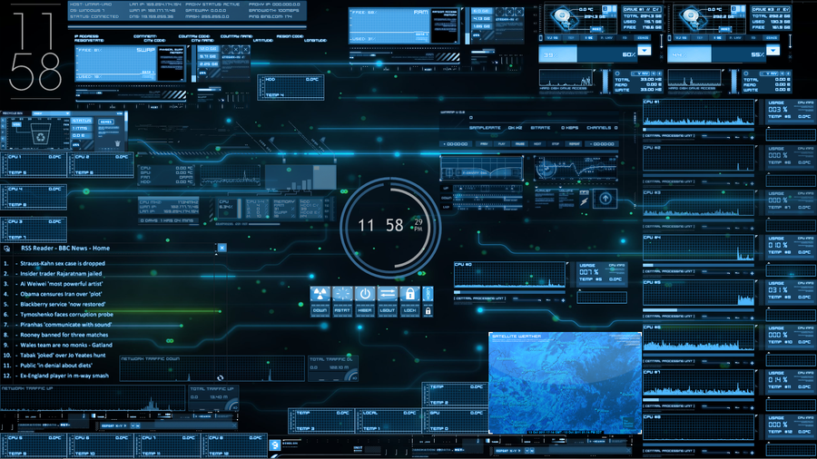

Chronos
=======
> (doc 1.0)

-----

## 1. C'est quoi ?
**Chronos** est le nom de projet d'un [environnement de bureau](https://fr.wikipedia.org/wiki/Environnement_de_bureau) sous gnu linux visant à améliorer la _productivité_ et le _confort_ des utilisateurs dans la vie quotidienne.
## 2. Technologies utilisées
L'environnement sera principalement programmé en **C**, **C++** pour des soucis de performances et de contrôle, **Python** sera envisageable pour des programmes n'abordant aucun aspect critique.

Les principales bibliothèques qui seront utilisées :

* Xlib / XCB
* Gtk+3.0 (GUI)
* Libchronos (système)
* Cairo (Dessins 2D)
* libdbus 1.8.x (communication inter processus)
* Telepathy (framework de communication (chat, VOIP, visio-conférence ...))

## 3. Exemples de fonctionnalités
Les réels atouts de Chronos résident dans le fait que la totalité de l'environnement sera utilisable au **clavier** et optionnellement à la souris, améliorant ainsi votre temps de réponse entre chaque tâche.
Il disposera d'une **interface entièrement paramètrable** qui vous permettra d'avoir accès à bon nombre de fonctionnalités rapidement (processeurs, meteo, irc...).
Le **gestionnaire de fenêtres intelligent** permettra un positionnement sûr et efficace de chaque fenêtre pour utiliser au mieux votre espace de travail.