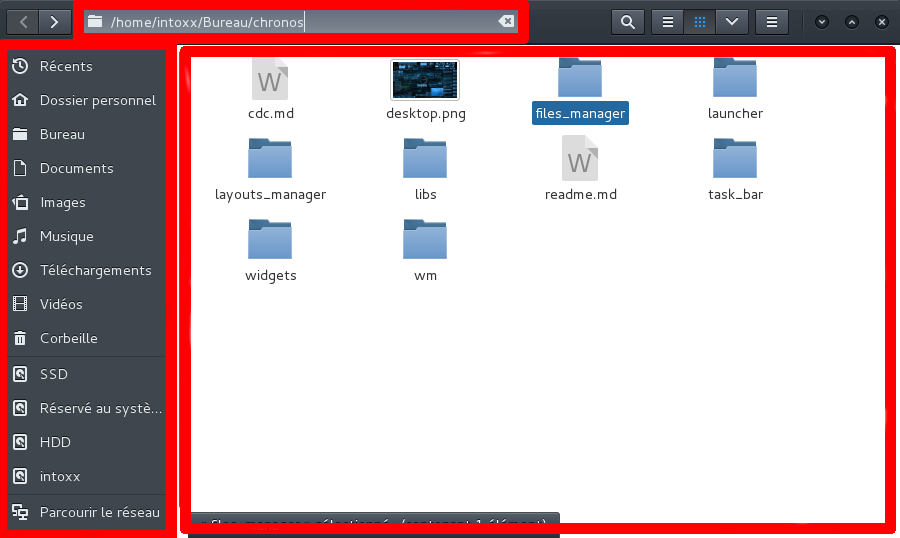

Chronos : Files Manager
=======================

## Présentation
> Temporaire

Un gestionnaire de fichiers sera requis pour le bon fonctionnement de l'environnement.
Ses principales fonctionnalités seront :

* la navigation dans chaque dossier de la hiérarchie linux
* l'accès à l'information sur chaque fichier / dossier (taille etc ..)
* le lancement de fichiers liés à certains type de programmes
* la recherche
...

## Technologies
Langages : **C, C++**
Bibliothèques : **Gtk(C), Gtkmm(C++), Libchronos**
Priorité : **faible** (utilisation d'un autre gestionnaire en attendant)

## Besoins
Le gestionnaire de fichiers devra respecter une interface relativement sobre permettant d'être facilement modifiée à l'avenir.

Elle devra inclure au minimum **3 layouts** :

* un pour la barre d'adresse en haut, permettant via l'execution d'un raccourci de rapidement modifier l'emplacement
* un pour le menu qui servira à afficher les dossiers / marques pages primordiaux (tel que **bureau, disque dur, téléchargements**...), il devra d'autant plus permettre à l'utilisateur d'en ajouter / supprimer.
* un représentant le contexte global (vue actuelle) où seront affichés chaque dossier / fichiers présents dans l'emplacement actuel.

*voir schema pour une meilleure compréhension*

## Cahier des charges
> Temporaire

1. Créer plusieurs structures/classes et définition des types de base permettant la création de la fenêtre principale (**MainWindow**)
Elle devra par défaut s'afficher au milieu de l'écran (temporaire)
2. Création des premiers layouts (barre de navigation, menu de navigation, vue actuelle)
	* **Barre de navigation** : elle devra rester simple, un champ de texte suffira avec à sa droite un bouton permettant de valider l'entrée (ainsi qu'un raccourci (entrer))
	* **Menu de navigation** : il devra respecter une architecture permettant d'afficher la navigation sur le disque via une icone et un texte, permettant de plier / déplier les sous dossier.
	* **Vue actuelle** : elle devra afficher chaque icone avec en dessous le nom du dossier/fichier dans son espace, la sélection par clique gauche et l'accès à un menu contextuel par click droit seront primordiaux.
3. Création du menu (fichiers, édition, vue, paramètres) et de la toolbar.
4. ... 